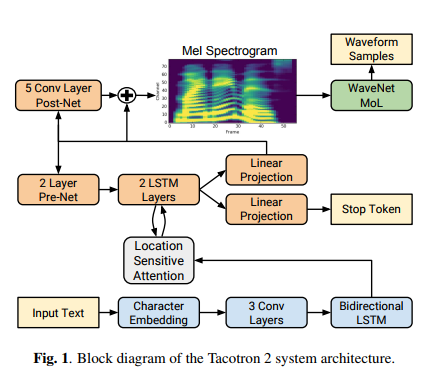
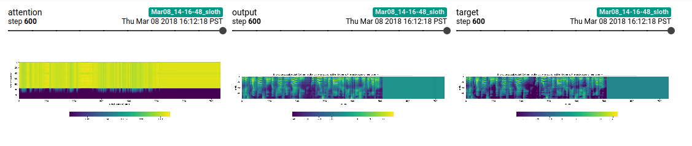
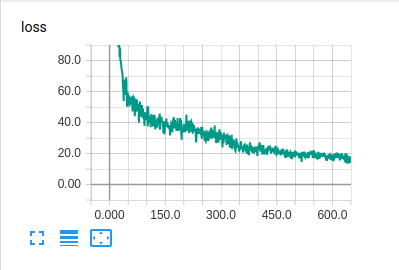

# Tacotron2


NATURAL TTS SYNTHESIS BY CONDITIONING WAVENET ON MEL SPECTROGRAM
PREDICTIONS
https://arxiv.org/pdf/1712.05884.pdf

WaveNet: A Generative Model for Raw Audio
## Contents
- Simple LJ Speech DataLoader
- Mel Spectrogram Prediction network (text to Spectrogram)
- [TODO] WaveNet Vocoder (Spectrogram to raw audio)

https://arxiv.org/abs/1609.03499

## Setup

2. install pytorch and torchvision:
```
conda install pytorch -c pytorch
```

3. install tensorflow and tensorboardX for logging.
```
pip install tensorboard
pip install tensorboardX
```

## Usage
train Spectrogram Prediction Network
```
python train.py
```

view logs in Tensorboard
```
tensorboard --logdir runs
```





